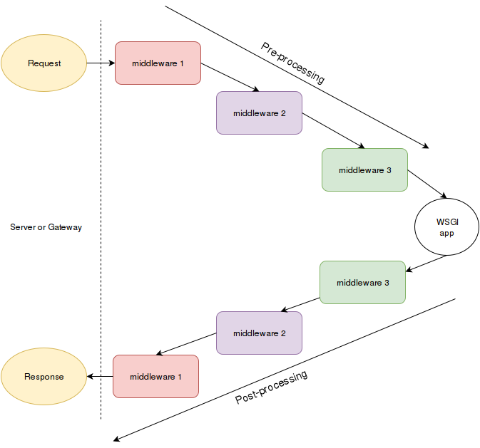

# 中间件 - Middleware

对于服务端来说中间件可以充当应用，响应服务器发来的请求；而对应用端来说中间件则充当了服务器的角色，与应用端进行交互。中间件就像餐厅里的服务员，把大餐(数据)从厨师(服务器)手中接过，传递给客户(应用端)，客户如果对饭菜不满意，会经由服务员反馈给大厨。



中间件这个概念在很多 web 框架中都存在，这与编程语言无关。nodejs 和 django 会更加显式的申明中间件，比如下面 nodejs 的中间件，每次应用端收到 request 都会打印出当前时间。

```javascript
app.use((req, res, next) => {
  console.log("Time:", Date.now());
  next();
});
```

作为 WSGI 框架之一的 flask 则用了 extension/plugin 的概念，应用端 app 被 extension 包裹，以达到中间件的目的。

当然也可以直接用 flask 的 before_request, after_request 去达到同样效果。

```python
"""
Example how flask uses middleware wrapping around the application
"""
from flask import Flask
from flask_login import LoginManager

app = Flask(__name__)
login_manager = LoginManager()
login_manager.init_app(app)
```

下面这一部分是 flask_login 里 init_app 的代码，作用是把 LoginManager 这个中间件挂载在 flask app 这个全局实例上，同时在每次 request 循环后触发一个\_update_remember_cookie 的任务来更新 cookie，以保持登录状态。

```python
def init_app(self, app, add_context_processor=True):
    """
    Configures an application. This registers an `after_request` call, and
    attaches this `LoginManager` to it as `app.login_manager`.

    :param app: The :class:`flask.Flask` object to configure.
    :type app: :class:`flask.Flask`
    :param add_context_processor: Whether to add a context processor to
        the app that adds a `current_user` variable to the template.
        Defaults to ``True``.
    :type add_context_processor: bool
    """
    app.login_manager = self
    app.after_request(self._update_remember_cookie)

    if add_context_processor:
        app.context_processor(_user_context_processor)
```

### 第一个 WSGI 中间件

我们来自己做一个 WSGI 中间件。

hello_world_app 是一个简单的 WSGI 应用，它会返回 Hello World 字符串，并添加相应的 headers，给客户端浏览器。

log_environ 是我们做的中间件，采用闭包和装饰器。内部的\_inner 函数会打印出 WSGI 服务端(httpd)发来的 environ 环境变量, 最终把由 hello_world_app WSGI 应用端产生的结果返回给浏览器。

所以这个流程是先由浏览器发送 get 请求给 WSGI 服务器，服务器会整理请求的环境变量并把 environ 和 start_response 对象打包发给 WSGI 中间件，这个 log_environ 中间件会先把 environ 打印出来，然后调用 WSGI 客户端 hello_world_app，并把客户端的结果 Hello World 返回给服务器，再由服务器传回浏览器，最终结果在浏览器上呈现。

可以看的出 log_environ 就是装饰器，目的是加强 WSGI 应用端原有的功能，所以在 hello_world_app 上采用装饰器语法 @log_environ 也是能正常工作的。

写法一

```python
from wsgiref.simple_server import make_server


def hello_world_app(environ, start_response):
    status = '200 OK'  # HTTP Status
    # HTTP Headers
    headers = [('Content-type', 'text/plain; charset=utf-8')]
    start_response(status, headers)

    # The returned object is going to be printed
    return [b"Hello World"]


def log_environ(handler):
    """print the envrionment dictionary to the console"""
    from pprint import pprint

    def _inner(environ, start_function):
        pprint(environ)
        return handler(environ, start_function)

    return _inner


# this will show "Hello World!" in your browser,
# and the environment in the console
app = log_environ(hello_world_app)


httpd = make_server('', 8000, app)
print("Serving on port 8000...")
# Serve until process is killed
httpd.serve_forever()

```

写法 2

```python
from wsgiref.simple_server import make_server

def log_environ(handler):
    """print the envrionment dictionary to the console"""
    from pprint import pprint

    def _inner(environ, start_function):
        pprint(environ)
        return handler(environ, start_function)

    return _inner

@log_environ
def hello_world_app(environ, start_response):
    status = '200 OK'  # HTTP Status
    # HTTP Headers
    headers = [('Content-type', 'text/plain; charset=utf-8')]
    start_response(status, headers)

    # The returned object is going to be printed
    return [b"Hello World"]


httpd = make_server('', 8001, hello_world_app)
print("Serving on port 8001...")
# Serve until process is killed
httpd.serve_forever()

```
