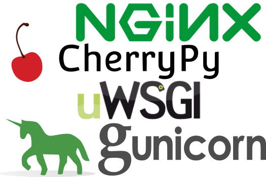
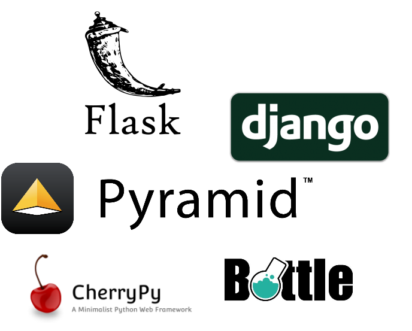

# Python web 框架

2000 年后 python web 应用框架逐渐涌现，当时比较流行的 web 应用框架有 twisted, Zope 等等。这些框架并没有统一的标准，导致 web 服务器要做不同的适配才能接入这些框架，繁琐的配置限制了 python web 开发的发展，通常情况下这些 web 框架只能在 CGI，FASTCGI，mod_python 之间做取舍。

### WSGI

WSGI (Web Server Gateway Interface) 是作为 Web 服务器与 Web 应用程序或应用框架之间的一种接口，以提升 python web 开发的可移植性。

WSGI 协议被定义在 [PEP333](https://peps.python.org/pep-0333) 当中，有兴趣的小伙伴可以详细阅读。

WSGI 增强了 python 应用程序的拓展性和灵活性，用户可以自由组合下面任意的 wsgi server 和 wsgi framework 以建立 web 应用。

### WSGI 服务端和 WSGI 应用端

WSGI 接口有服务端和应用端两部分，服务端也可以叫网关端，应用端也叫框架端。服务端调用一个由应用端提供的可调用对象。如何提供这个对象，由服务端决定。例如某些服务器或者网关需要应用的部署者写一段脚本，以创建服务器或者网关的实例，并且为这个实例提供一个应用实例。另一些服务器或者网关则可能使用配置文件或其他方法以指定应用实例应该从哪里导入或获取。

### WSGI Servers

### WSGI Frameworks

